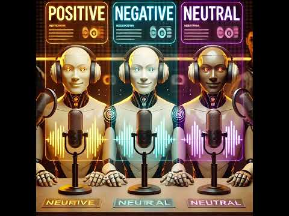
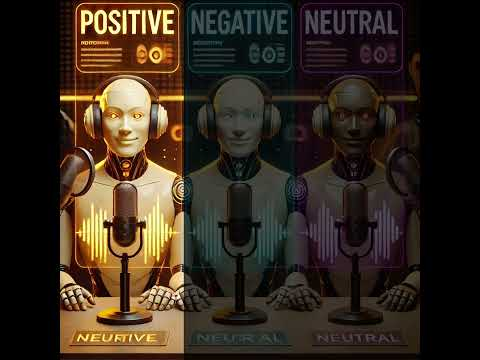
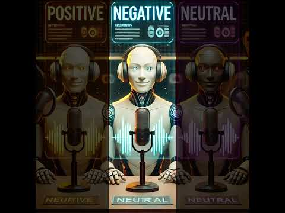
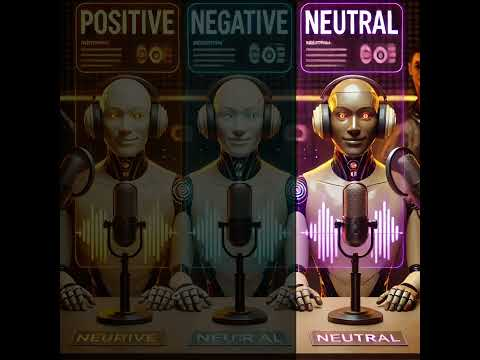

## Subtle_AI_Alignment

**FINAL PODCAST HERE:**

CTRL-CLICK TO OPEN VIDEO IN NEW WINDOW  
  
YOUTUBE: https://www.youtube.com/watch?v=FuxUXSK8b24

**Podcast Description:**

This article: https://www.dr.dk/nyheder/kultur/rane-willerslev-oensker-ikke-donere-sine-organer-og-vil-bisaettes-med-sin-jagtbue-dem

...was read by 3 specific (positive/neutral/negative) aligned AI Agents and they each made a podcast about their view on the article.

CTRL-CLICK TO OPEN VIDEO IN NEW WINDOW  
 

CTRL-CLICK TO OPEN VIDEO IN NEW WINDOW  
 

CTRL-CLICK TO OPEN VIDEO IN NEW WINDOW  
 

Finally a (neutral) AI Agent analyzed the alignment of the podcasts and made a podcast about it, see "Final podcast" top of page.

--------------------------------------------  
Podcasts created with https://notebooklm.google.com/
