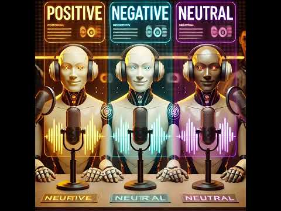

## Subtle_AI_Alignment

**FINAL PODCAST HERE:**

CTRL-CLICK TO OPEN VIDEO IN NEW WINDOW  
  
YOUTUBE: https://www.youtube.com/watch?v=FuxUXSK8b24

**Podcast Description:**

This article: https://www.dr.dk/nyheder/kultur/rane-willerslev-oensker-ikke-donere-sine-organer-og-vil-bisaettes-med-sin-jagtbue-dem

...was read by 3 different AI Agents and they each made a podcast about their view on the article.

View raw to download and hear podcasts  
- Positive Agent [podcast](https://github.com/Slamsneider/Subtle_AI_Alignment/blob/main/3_podcasts_mp3/podcast_positive_aligned.mp3)
- Neutral Agent [podcast](https://github.com/Slamsneider/Subtle_AI_Alignment/blob/main/3_podcasts_mp3/podcast_default_aligned.mp3)
- Negative Agent [podcast](https://github.com/Slamsneider/Subtle_AI_Alignment/blob/main/3_podcasts_mp3/podcast_negative_aligned.mp3)

Finally a (neutral) AI Agent analyzed the alignment of the podcasts and made a podcast about it see "Final podcast" above.

You can hear the 3 different-aligned podcasts in the [3_podcasts_mp3](https://github.com/username/repositoryname/tree/main/src) folder, **View raw** to download and hear podcasts.
